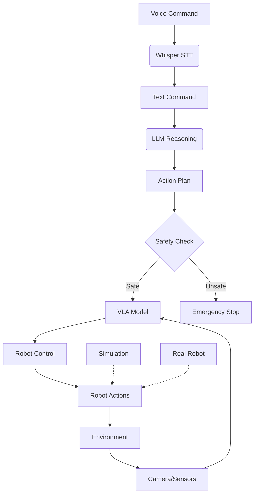

# Capstone: Integrated Physical AI Project

## Overview

In this capstone project, you'll integrate all the components learned throughout the course to create a complete Physical AI system. You'll combine ROS 2 for robot control, simulation for testing, NVIDIA Isaac for advanced perception and navigation, and Vision-Language-Action models for intelligent robot behavior.

## Project Objectives

- Integrate all four modules into a cohesive robotic system
- Implement a complete VLA pipeline from voice command to robot action
- Demonstrate safe and effective robot behavior in simulation and (optionally) on real hardware
- Validate the system through systematic testing

## System Architecture



## Implementation Steps

### Step 1: Environment Setup

First, ensure all components are properly installed and configured:

```bash
# Setup ROS 2 workspace
mkdir -p ~/physical_ai_ws/src
cd ~/physical_ai_ws

# Clone necessary packages
git clone https://github.com/NVIDIA-ISAAC-ROS/isaac_ros_common.git src/isaac_ros_common
git clone https://github.com/ros-planning/navigation2.git src/navigation2

# Build the workspace
colcon build
source install/setup.bash
```

### Step 2: Robot Model Integration

Create a comprehensive robot model that includes all necessary sensors:

```xml
<!-- Complete robot model with sensors -->
<?xml version="1.0"?>
<robot name="physical_ai_robot" xmlns:xacro="http://www.ros.org/wiki/xacro">
  <!-- Base with differential drive -->
  <link name="base_link">
    <visual>
      <geometry>
        <box size="0.6 0.4 0.2"/>
      </geometry>
      <material name="gray">
        <color rgba="0.5 0.5 0.5 1"/>
      </material>
    </visual>
    <collision>
      <geometry>
        <box size="0.6 0.4 0.2"/>
      </geometry>
    </collision>
    <inertial>
      <mass value="10.0"/>
      <inertia ixx="0.1" ixy="0.0" ixz="0.0" iyy="0.1" iyz="0.0" izz="0.1"/>
    </inertial>
  </link>

  <!-- RGB-D Camera -->
  <joint name="camera_joint" type="fixed">
    <parent link="base_link"/>
    <child link="camera_link"/>
    <origin xyz="0.2 0 0.1" rpy="0 0 0"/>
  </joint>

  <link name="camera_link">
    <visual>
      <geometry>
        <box size="0.05 0.05 0.05"/>
      </geometry>
    </visual>
  </link>

  <!-- LiDAR -->
  <joint name="lidar_joint" type="fixed">
    <parent link="base_link"/>
    <child link="lidar_link"/>
    <origin xyz="0.15 0 0.15" rpy="0 0 0"/>
  </joint>

  <link name="lidar_link">
    <visual>
      <geometry>
        <cylinder radius="0.03" length="0.05"/>
      </geometry>
    </visual>
  </link>

  <!-- Gazebo plugins for simulation -->
  <gazebo reference="base_link">
    <material>Gazebo/Grey</material>
  </gazebo>

  <gazebo reference="camera_link">
    <sensor type="camera" name="camera1">
      <update_rate>30.0</update_rate>
      <camera name="head">
        <horizontal_fov>1.3962634</horizontal_fov>
        <image>
          <width>800</width>
          <height>600</height>
          <format>R8G8B8</format>
        </image>
        <clip>
          <near>0.02</near>
          <far>300</far>
        </clip>
      </camera>
      <plugin name="camera_controller" filename="libgazebo_ros_camera.so">
        <frame_name>camera_link</frame_name>
      </plugin>
    </sensor>
  </gazebo>

  <gazebo>
    <plugin name="differential_drive" filename="libgazebo_ros_diff_drive.so">
      <left_joint>left_wheel_joint</left_joint>
      <right_joint>right_wheel_joint</right_joint>
      <wheel_separation>0.4</wheel_separation>
      <wheel_diameter>0.15</wheel_diameter>
      <command_topic>cmd_vel</command_topic>
      <odometry_topic>odom</odometry_topic>
      <odometry_frame>odom</odometry_frame>
      <robot_base_frame>base_link</robot_base_frame>
    </plugin>
  </gazebo>
</robot>
```

### Step 3: Main Integration Node

Create the main integration node that ties all components together:

```python
#!/usr/bin/env python3
# main_integration_node.py

import rclpy
from rclpy.node import Node
from sensor_msgs.msg import Image, LaserScan
from geometry_msgs.msg import Twist
from std_msgs.msg import String, Bool
from cv_bridge import CvBridge
import torch
import whisper
import json
import numpy as np
from transformers import CLIPProcessor, CLIPModel

class PhysicalAIIntegrator(Node):
    def __init__(self):
        super().__init__('physical_ai_integrator')

        # Initialize components
        self.cv_bridge = CvBridge()

        # Initialize models
        self.clip_model = CLIPModel.from_pretrained("openai/clip-vit-base-patch32")
        self.clip_processor = CLIPProcessor.from_pretrained("openai/clip-vit-base-patch32")
        self.whisper_model = whisper.load_model("base")

        # Publishers and subscribers
        self.image_sub = self.create_subscription(Image, '/camera/rgb/image_raw', self.image_callback, 10)
        self.laser_sub = self.create_subscription(LaserScan, '/scan', self.laser_callback, 10)
        self.voice_sub = self.create_subscription(String, '/voice_command', self.voice_callback, 10)
        self.cmd_pub = self.create_publisher(Twist, '/cmd_vel', 10)

        # Internal state
        self.current_image = None
        self.laser_data = None
        self.command_queue = []
        self.is_active = True

        self.get_logger().info('Physical AI Integrator initialized')

    def image_callback(self, msg):
        """Process camera input"""
        try:
            self.current_image = self.cv_bridge.imgmsg_to_cv2(msg, desired_encoding='bgr8')
        except Exception as e:
            self.get_logger().error(f'Image processing error: {e}')

    def laser_callback(self, msg):
        """Process laser scan"""
        self.laser_data = msg

    def voice_callback(self, msg):
        """Process voice command"""
        command = msg.data
        self.get_logger().info(f'Processing command: {command}')

        if self.current_image is not None:
            action = self.process_command_with_vision(command)
            self.execute_action(action)

    def process_command_with_vision(self, command):
        """Process command using vision and language understanding"""
        if not self.current_image:
            self.get_logger().warn('No image available')
            return Twist()  # Return stop command

        # Use CLIP to understand the relationship between image and command
        inputs = self.clip_processor(text=[command], images=self.current_image, return_tensors="pt", padding=True)
        outputs = self.clip_model(**inputs)
        logits_per_image = outputs.logits_per_image
        probs = logits_per_image.softmax(dim=1)

        # Map command to action based on understanding
        return self.map_command_to_action(command)

    def map_command_to_action(self, command):
        """Map natural language command to robot action"""
        action = Twist()

        command_lower = command.lower()

        if any(word in command_lower for word in ['forward', 'go', 'move', 'ahead']):
            action.linear.x = 0.3
        elif any(word in command_lower for word in ['backward', 'back', 'reverse']):
            action.linear.x = -0.3
        elif any(word in command_lower for word in ['left', 'turn left', 'rotate left']):
            action.angular.z = 0.5
        elif any(word in command_lower for word in ['right', 'turn right', 'rotate right']):
            action.angular.z = -0.5
        elif 'stop' in command_lower:
            action.linear.x = 0.0
            action.angular.z = 0.0
        else:
            # For complex commands, implement more sophisticated parsing
            action.linear.x = 0.1  # Small forward movement as default

        # Apply safety checks
        if self.laser_data:
            min_distance = min(self.laser_data.ranges)
            if min_distance < 0.5 and action.linear.x > 0:  # Safety: stop if obstacle close ahead
                action.linear.x = 0.0
                self.get_logger().warn('Safety stop: obstacle detected ahead')

        return action

    def execute_action(self, action):
        """Execute the planned action"""
        self.cmd_pub.publish(action)
        self.get_logger().info(f'Executing action: linear.x={action.linear.x}, angular.z={action.angular.z}')

def main(args=None):
    rclpy.init(args=args)
    integrator = PhysicalAIIntegrator()

    try:
        rclpy.spin(integrator)
    except KeyboardInterrupt:
        pass
    finally:
        integrator.destroy_node()
        rclpy.shutdown()

if __name__ == '__main__':
    main()
```

### Step 4: Launch File

Create a launch file to start the complete system:

```python
# launch/physical_ai_system.launch.py
from launch import LaunchDescription
from launch_ros.actions import Node
from ament_index_python.packages import get_package_share_directory
import os

def generate_launch_description():
    return LaunchDescription([
        # Main integration node
        Node(
            package='physical_ai_project',
            executable='main_integration_node',
            name='physical_ai_integrator',
            output='screen',
            parameters=[
                {'use_sim_time': True}
            ]
        ),

        # Additional nodes can be added here
        # For example: voice processing, safety validation, etc.
    ])
```

## Testing and Validation

### Unit Tests

```python
# test_physical_ai_system.py
import unittest
import rclpy
from geometry_msgs.msg import Twist
from std_msgs.msg import String

class TestPhysicalAISystem(unittest.TestCase):
    def setUp(self):
        rclpy.init()
        self.node = rclpy.create_node('test_physical_ai_node')

    def tearDown(self):
        self.node.destroy_node()
        rclpy.shutdown()

    def test_command_mapping(self):
        """Test that commands are properly mapped to actions"""
        # This would test the map_command_to_action method
        pass

    def test_safety_validation(self):
        """Test that safety checks work properly"""
        # This would test obstacle avoidance and safety features
        pass

if __name__ == '__main__':
    unittest.main()
```

## Deployment Considerations

### Simulation vs. Real Robot

The system is designed to work in both simulation and on real hardware:

- Use `use_sim_time` parameter to synchronize with simulation clock
- Implement sensor fusion to handle differences between simulated and real sensors
- Add calibration procedures for real-world deployment

### Performance Optimization

- Use GPU acceleration for vision processing where available
- Implement efficient data structures for real-time processing
- Consider model quantization for edge deployment
- Optimize communication patterns to reduce latency

## Evaluation Metrics

- **Task Completion Rate**: Percentage of commands successfully executed
- **Safety Compliance**: Number of safety violations during operation
- **Response Time**: Time from command to action execution
- **Accuracy**: How well the robot interprets and executes commands

## Conclusion

This capstone project integrates all the concepts learned throughout the course into a comprehensive Physical AI system. The project demonstrates how ROS 2, simulation, Isaac tools, and VLA models can work together to create intelligent, safe, and effective robotic systems.

The modular design allows for easy extension and modification, making it suitable for various robotics applications. The safety-first approach ensures responsible AI deployment in physical systems.